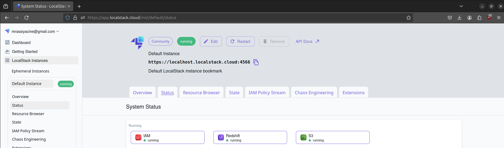
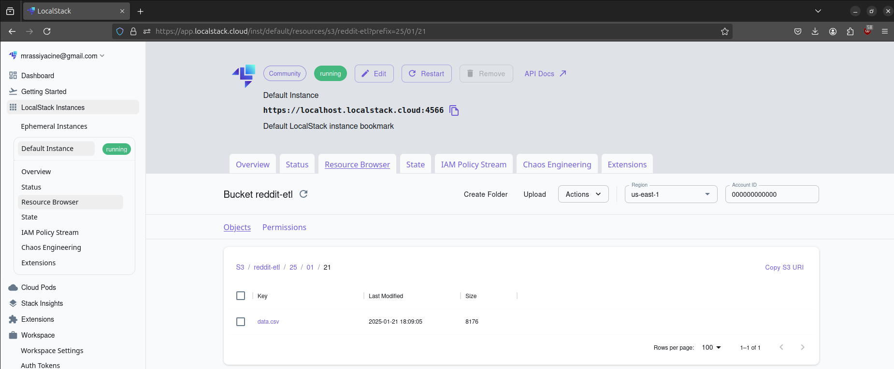
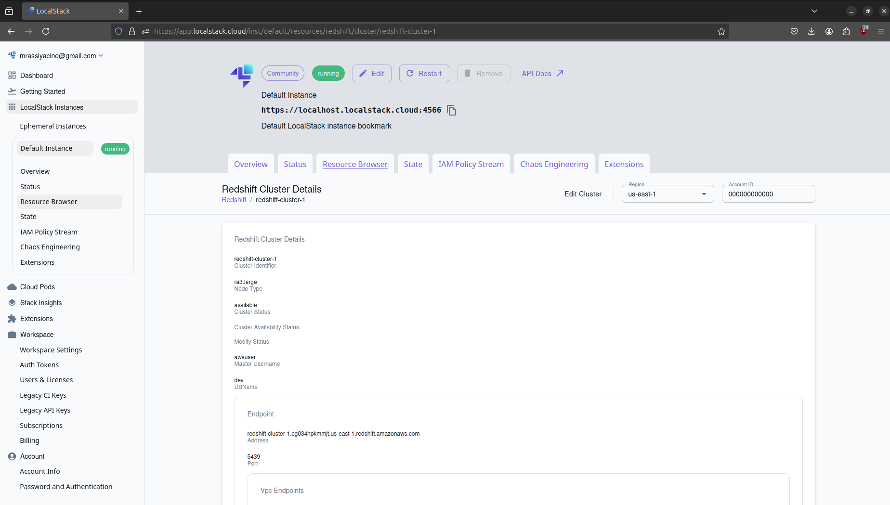

# ETL Project with Boto3 and LocalStack

## Overview
This project is designed to explore and test AWS services using **Boto3** and **LocalStack**, simulating an AWS environment locally. The project focuses on setting up and managing cloud infrastructure for an ETL (Extract, Transform, Load) pipeline. It includes extracting information about posts from the Reddit API, processing the data, and storing it in AWS S3 and then loading it in Redshift.

Note: There is a known issue in the LocalStack Community edition where Redshift clusters are created but cannot be connected. This bug has been addressed in the LocalStack Pro edition.

## Components

### 1. `src/main.py`
This is the main entry point of the project. It contains the following functions:
- **`setup_infra()`**
  - Creates an S3 bucket.
  - Creates a Redshift cluster.

- **`main()`**
  - Sets up IAM roles and policies to allow Redshift to access S3.
  - Executes the ETL pipeline functions in sequence.

### 2. `etl/` 
This directory contains the ETL pipeline functions:
- **`get_reddit_data.py`**: Extracts data from Reddit API, including post details such as titles, scores, and timestamps.
- **`upload_data_to_s3.py`**: Uploads extracted data to an S3 bucket.
- **`load_data_to_redshift.py`**: Loads data from S3 to the Redshift cluster.

### 3. `utils/`
Contains service managers responsible for interactions with AWS services using **Boto3**:
- **`IAMManager.py`**: Manages IAM roles and policies.
- **`RedshiftManager.py`**: Handles operations related to Amazon Redshift.
- **`S3Manager.py`**: Manages S3 bucket operations.

### 4. Configuration Files
- **`config.py`**: Contains project configurations, such as environment variables.
- **`iam_config.json`**: Stores IAM role configurations.
- **`.env`**: Environment variables for sensitive credentials, with the following format:
  ```ini
  REDDIT_CLIENT_ID=""
  REDDIT_CLIENT_SECRET=""
  REDDIT_USER_AGENT=""
  
  BUCKET_NAME="reddit-etl"
  ```

### 5. Supporting Files
- **`docker-compose.yml`**: Defines services to run the project locally using LocalStack.
- **`requirements.txt`**: Lists Python dependencies.
- **`.pre-commit-config.yaml`**: Configuration for pre-commit hooks.
- **`.flake8`** and **`.isort.cfg`**: Linting and formatting configurations.

## Setup Instructions

### Prerequisites
Ensure you have the following installed:
- **Docker** and **Docker Compose**
- **Python 3.x**
- **Pip**

### Installation
1. Clone the repository:
   ```bash
   https://github.com/mrassiyacine/etl-reddit.git
   cd your-repo
   ```
2. Create a virtual environment:
   ```bash
   python -m venv venv
   source venv/bin/activate
   export PYTHONPATH=~/path/etl-reddit
   ```
3. Install dependencies:
   ```bash
   pip install -r requirements.txt
   ```
4. Set up environment variables in `.env` file.

### Running the Project
1. Start LocalStack using Docker Compose:
   ```bash
   docker-compose up -d
   ```
2. Run the main program:
   ```bash
   python src/main.py
   ```
### Viewing Services
Once the infrastructure is set up, you can verify the created resources using:
- AWS CLI commands:
  ```bash
  aws s3 ls
  aws redshift describe-clusters
  ```
- Alternatively, you can use **LocalStack Desktop**, which provides a graphical interface to inspect resources. 

  
  
  


